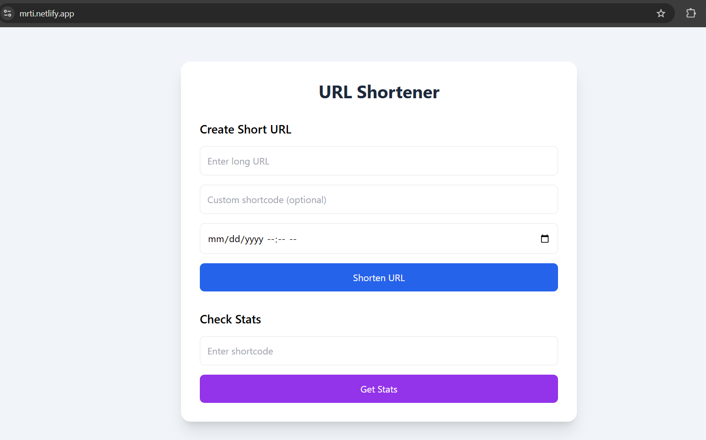
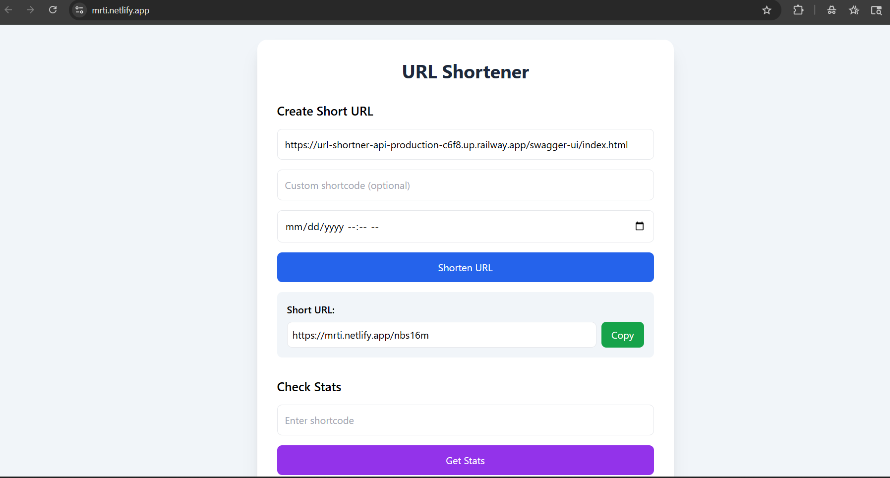
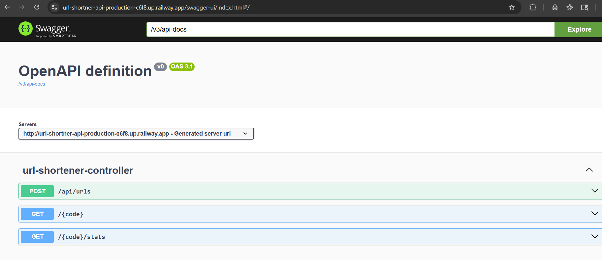
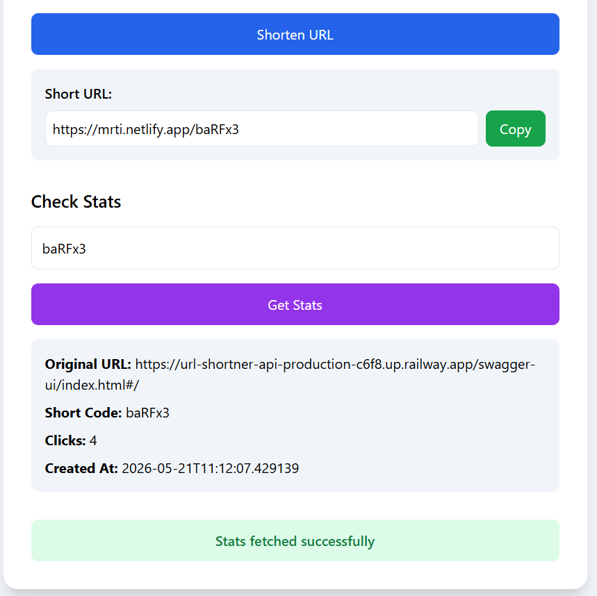

# 🔗 URL Shortener

A full-stack URL shortening application built with **Spring Boot, MySQL, Railway, and Netlify** that allows users to shorten long URLs, generate custom aliases, track click analytics, and manage expiring links.

## 🌐 Live Demo

**Frontend:** https://mrti.netlify.app  
**Swagger API Docs:** https://url-shortner-api-production-c6f8.up.railway.app/swagger-ui/index.html

---

## ✨ Features

- Shorten long URLs instantly
- Custom short code support
- URL redirection to original destination
- Click count analytics
- URL expiry support
- RESTful API design
- Swagger/OpenAPI API documentation
- Global exception handling
- Input validation
- Persistent MySQL storage
- Frontend UI for shortening + stats lookup
- Full cloud deployment (Railway + Netlify)

---

## 🏗 Architecture

```text
User
  ↓
Netlify Frontend (mrti.netlify.app)
  ↓
Netlify Redirect Proxy
  ↓
Spring Boot Backend (Railway)
  ↓
MySQL Database (Railway)
```

---

## 🛠 Tech Stack

### Backend
- Java 21
- Spring Boot
- Spring Web
- Spring Data JPA
- Hibernate
- MySQL
- Maven
- Lombok
- Swagger / OpenAPI

### Frontend
- HTML
- CSS
- Tailwind CSS
- JavaScript

### Deployment
- Railway (Backend + MySQL)
- Netlify (Frontend)

### Testing
- JUnit 5
- Mockito
- MockMvc

---

## 📁 Project Structure

```text
URL_Shortner
│
├── Frontend
│   ├── index.html
│   ├── script.js
│   └── _redirects
│
├── src
│   ├── main
│   │   ├── java/com/Project/URL/Shortner
│   │   │   ├── config
│   │   │   ├── controller
│   │   │   ├── DTO
│   │   │   ├── entity
│   │   │   ├── exceptions
│   │   │   ├── repository
│   │   │   ├── service
│   │   │   └── util
│   │   └── resources
│   │
│   └── test
│       ├── controller
│       └── service
│
├── pom.xml
└── README.md
```

---

## 🚀 API Endpoints

### Create Short URL

**POST**
```http
/api/urls
```

**Request**
```json
{
  "originalUrl": "https://google.com",
  "customCode": "google"
}
```

**Response**
```json
{
  "originalUrl": "https://google.com",
  "shortUrl": "https://mrti.netlify.app/google",
  "shortCode": "google"
}
```

---

### Redirect to Original URL

**GET**
```http
/{shortCode}
```

Example:
```text
https://mrti.netlify.app/google
```

Behavior:
- Finds original URL
- Increments click count
- Redirects to original destination

---

### Get URL Statistics

**GET**
```http
/api/urls/{shortCode}/stats
```

**Response**
```json
{
  "originalUrl": "https://google.com",
  "shortCode": "google",
  "clickCount": 12,
  "createdAt": "2026-05-21T15:20:11"
}
```

---

## ⚠ Error Handling

### Invalid URL
```json
{
  "message": "Invalid URL is given",
  "status": 400
}
```

### Short Code Already Exists
```json
{
  "message": "Short code already exists",
  "status": 409
}
```

### URL Not Found
```json
{
  "message": "Short code not found",
  "status": 404
}
```

### URL Expired
```json
{
  "message": "URL has expired",
  "status": 410
}
```

---

## 🧪 Testing

Implemented tests for:

- Service layer business logic
- Controller endpoints
- Exception handling
- URL expiry logic
- Click count increment validation
- Stats retrieval
- Duplicate custom code validation

Run tests:

```bash
./mvnw test
```

---

## ⚙ Local Setup

### Clone Repository

```bash
git clone https://github.com/Mritunjay28/URL_Shortner.git
cd URL_Shortner
```

---

### Configure Database

Update:

```properties
src/main/resources/application.properties
```

Example:

```properties
spring.datasource.url=jdbc:mysql://localhost:3306/urlshortener
spring.datasource.username=root
spring.datasource.password=your_password

spring.jpa.hibernate.ddl-auto=update
```

---

### Run Backend

```bash
./mvnw spring-boot:run
```

---

### Run Frontend

Open:

```text
Frontend/index.html
```

using Live Server.

---

## ☁ Deployment

### Backend
Deployed on Railway:
- Spring Boot API
- Railway MySQL database

### Frontend
Deployed on Netlify:
- Static frontend hosting
- Redirect proxy routing to backend

---

## 📸 Screenshots

### Homepage


### URL Shortening


### Swagger API Documentation


### URL Analytics


## 📌 Future Improvements

- QR code generation
- Redis caching
- Rate limiting
- Docker containerization
- GitHub Actions CI/CD
- User authentication
- Dashboard analytics charts
- Custom branded domain support

---

## 💡 Learning Outcomes

This project helped strengthen:

- REST API development
- Layered backend architecture
- DTO pattern
- Exception handling
- Spring Boot testing
- JPA/Hibernate persistence
- Cloud deployment
- Reverse proxy routing
- CORS configuration
- Production debugging
- Frontend-backend integration

---

## 👨‍💻 Author

**Mritunjay Senapati**

Built as a full-stack backend-focused engineering project.